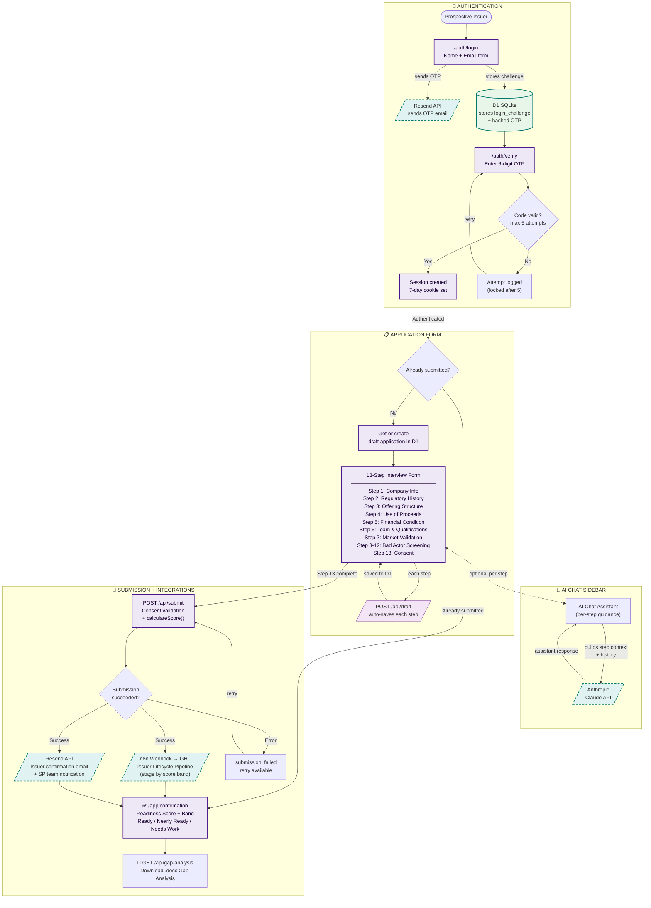

# SP-IssuerApplication: AI-Guided Issuer Prequalification

## Project Overview

An AI-guided interview application for prospective SyndicatePath issuers to complete as part of the prequalification process for Regulation Crowdfunding (Reg CF) and other capital raising services.

**Purpose:** Qualify and prepare issuers by guiding them through comprehensive questions about their capital raise, ensuring they have thought through the key elements before engaging with SyndicatePath.

---

## Core Interview Framework

### The 7 Fundamental Questions (SyndicatePath Core)

Every issuer must clearly articulate answers to these fundamental questions:

1. **What do we want from investors?**
   - Amount seeking to raise (minimum/maximum)
   - Type of investment relationship
   - Level of investor involvement desired

2. **What will we do with the money we get from them?**
   - Specific use of proceeds
   - Budget allocation breakdown
   - Milestone-based spending plan

3. **When will they get their principal back?**
   - Exit strategy / liquidity event
   - Repayment timeline (for debt)
   - Expected holding period

4. **What will they get in consideration and when?**
   - Security type (equity, debt, revenue share, SAFE, etc.)
   - Returns/interest/dividends
   - Payment schedule

5. **What are the projected expenses and incomes to support the plan above?**
   - Financial projections (3-5 years)
   - Revenue model
   - Cost structure
   - Break-even analysis

6. **How and why are we sure we're the right people to deliver?**
   - Team qualifications
   - Relevant experience
   - Track record
   - Competitive advantages

7. **What are the assumptions and how gleaned and validated?**
   - Market assumptions
   - Validation methodology
   - Data sources
   - Risk factors

---

## Interview Sections (Expanded from SPPX + SP Core)

### Section 1: Company Information
*Reference: SPPX Page 1 - Issuer Details*

- Legal entity name
- State of incorporation
- Business address
- Phone / timezone
- Industry classification
- Pre-revenue status (Yes/No)
- Website URL
- Years in operation
- Business description (elevator pitch)

### Section 2: Regulatory History & Status
*Reference: SPPX Page 1 - Compliance Questions*

- Previous capital raising experience (Yes/No, details)
- Prior Reg CF offerings (Yes/No, details)
- Any regulatory final orders or actions
- Current compliance status (if prior offerings)
- Bad actor disqualification check
- EDGAR company page (if exists)

### Section 3: Offering Structure
*Reference: SPPX Page 2 & 3 + SP Core Questions 1, 3, 4*

**What are you raising?**
- Offering type: Reg CF / Reg D (506b/506c) / Reg A+ / Other
- Multiple offerings planned (Yes/No)
- Minimum target amount ($)
- Maximum raise amount ($)

**Security structure:**
- Security type:
  - Simple Equity
  - Preferred Equity
  - Debt/Note
  - Convertible Note
  - SAFE
  - Revenue Share Agreement
  - Other
- Key terms (interest rate, conversion terms, etc.)
- Investor rights and protections

**Investor returns:**
- When will investors receive returns?
- What is the expected exit timeline?
- How will principal be returned (if applicable)?

### Section 4: Use of Proceeds
*Reference: SP Core Question 2*

**Use of funds breakdown:**
- At minimum raise amount:
  - Category 1: $X (X%)
  - Category 2: $X (X%)
  - ...
- At maximum raise amount:
  - Category 1: $X (X%)
  - Category 2: $X (X%)
  - ...

**Milestone-based allocation:**
- What milestones will funds achieve?
- Priority of spending if minimum raised

### Section 5: Financial Condition
*Reference: SPPX Page 3 + SP Core Question 5*

**Current financial status:**
- Current financial statement availability:
  - Compiled
  - CPA Reviewed
  - CPA Audited
  - Not yet prepared
  - Formed less than 2 years ago
- Documents available:
  - Balance Sheet
  - Income Statement
  - Statement of Cash Flows
  - Statement of Owner's Equity
  - Notes/Footnotes

**Financial projections:**
- Revenue projections (Years 1-5)
- Expense projections (Years 1-5)
- Break-even timeline
- Key financial assumptions

### Section 6: Team & Qualifications
*Reference: SP Core Question 6*

**Leadership team:**
- CEO/Founder: Name, background, relevant experience
- Other key executives
- Board members / advisors
- Ownership percentages (20%+ beneficial owners)

**Why this team?**
- Relevant industry experience
- Prior startup/business success
- Domain expertise
- Network and relationships
- What unique advantages does your team bring?

### Section 7: Market & Validation
*Reference: SP Core Question 7*

**Market opportunity:**
- Target market size (TAM/SAM/SOM)
- Customer segments
- Competitive landscape
- Market trends

**Assumption validation:**
- Key assumptions driving projections
- How were assumptions validated?
- Customer validation (letters of intent, pilot customers, revenue)
- Market research conducted
- What risks could invalidate assumptions?

### Section 8: Business Planning
*Reference: SPPX Page 1*

**Business documentation:**
- Business plan: Current / Needs update / None
- Pitch deck available (Yes/No)
- Financial model available (Yes/No)

### Section 9: Capacity & Resources
*Reference: SPPX Timeline Template (60-day launch)*

**Time Commitment:**
- Can team dedicate 10-15 hours/week during prep phase?
- Communications Manager identified?
- Investor Relations Manager identified?

**Content & Assets:**
- Brand assets ready (logo, colors, guidelines)?
- Professional photos/video available?
- Customer testimonials or press coverage?
- Existing email list size?

**Technical:**
- Can open dedicated bank account for proceeds?
- DNS access for custom subdomain?

### Section 10: Timeline & Awareness
*Reference: SPPX Page 4 + Timeline Template*

**Campaign preferences:**
- Preferred launch date
- Understanding of 8-12 week prep timeline
- Awareness of 120+ hours for Form C preparation
- Conflicts in next 6 months?

**Ongoing Obligations Awareness:**
- Forum response requirements
- Campaign update requirements
- Form C-AR annual reporting
- Investor tax documents

### Section 11: Professional Team
*Reference: SPPX Page 5*

**Attorney:**
- Securities attorney engaged (Yes/No)
- Attorney name and contact
- Need referral (Yes/No)

**CPA/Accounting:**
- CPA engaged (Yes/No)
- CPA name and contact
- Services needed:
  - GAAP statement preparation
  - Independent review
  - Independent audit
- Need referral (Yes/No)

**Marketing:**
- Marketing agency/team engaged (Yes/No)
- In-house marketing capabilities
- Need referral (Yes/No)

### Section 12: Online Presence
*Reference: SPPX Page 6*

- Company website URL
- Investor relations page URL
- Social media presence
- DNS management comfort level
- Hosting provider

---

## AI Interview Design

### Conversational Flow

The AI interviewer should:

1. **Welcome & Set Expectations**
   - Explain the purpose of the interview
   - Estimate time (20-30 minutes)
   - Explain that answers help determine readiness and fit

2. **Progressive Disclosure**
   - Start with simple factual questions
   - Move to more complex strategic questions
   - Ask clarifying follow-ups based on responses

3. **Adaptive Questioning**
   - Skip irrelevant questions based on prior answers
   - Dive deeper on areas of concern or interest
   - Provide educational context when needed

4. **Real-time Feedback**
   - Note areas that need more development
   - Flag potential compliance issues
   - Highlight strengths

5. **Summary & Next Steps**
   - Provide preliminary assessment
   - Identify gaps to address
   - Outline next steps with SyndicatePath

### AI Persona Guidelines

**Tone:** Professional, supportive, educational
**Style:**
- Ask one question at a time
- Acknowledge answers before moving on
- Provide brief explanations for why questions matter
- Be encouraging but honest about concerns

**Key Behaviors:**
- Never provide legal or investment advice
- Always clarify that final determination requires full review
- Encourage completeness and honesty
- Flag when answers seem incomplete or inconsistent

---

## Output Format

After completion, the AI should generate:

### 1. Issuer Application Summary (JSON)
```json
{
  "company": {
    "name": "",
    "state": "",
    "industry": "",
    "preRevenue": true/false
  },
  "offering": {
    "type": "",
    "securityType": "",
    "minimumRaise": 0,
    "maximumRaise": 0
  },
  "readinessScore": {
    "overall": 0-100,
    "financials": 0-100,
    "team": 0-100,
    "documentation": 0-100,
    "validation": 0-100
  },
  "flags": [],
  "recommendations": []
}
```

### 2. Detailed Narrative Report
- Executive summary
- Detailed responses to each section
- Gap analysis
- Recommended next steps
- Timeline estimate

### 3. Checklist for SyndicatePath Team
- Documents needed
- Due diligence items
- Potential concerns to investigate
- Estimated complexity/timeline

---

## Integration Points

### GHL (GoHighLevel)
- Create/update contact on submission
- Add to Issuer Lifecycle pipeline
- Tag based on readiness score
- Trigger follow-up workflows

### Google Drive
- Store application summary
- Archive detailed responses
- Link to issuer folder

### Supabase
- Log application data
- Track conversion metrics
- Enable reporting/analytics

---

## Compliance Considerations

### Data Collection
- Clearly disclose data usage
- Obtain consent for storage
- Protect sensitive information
- Don't request SSN/financial details at this stage

### Regulatory Disclaimers
- No guarantee of acceptance
- Not investment advice
- Subject to full due diligence
- Regulatory requirements may change

### Bad Actor Screening
- Include preliminary bad actor questions
- Flag any potential disqualifications
- Note that full background check required

---

## Technical Implementation Options

### Option 1: Custom GPT (OpenAI)
- Create custom GPT with system prompt
- Easy to share via link
- Limited customization
- No direct integration

### Option 2: ChatGPT API + Custom UI
- Full control over experience
- Direct integration with SP systems
- Requires development effort
- Better data handling

### Option 3: n8n Workflow + Claude/GPT
- Automated pipeline processing
- Direct GHL/DB integration
- Form-based + AI follow-up hybrid
- Best for SP ecosystem

### Option 4: Typeform/JotForm + AI Analysis
- Simple form collection
- AI processes completed responses
- Familiar UX for applicants
- Separate AI analysis step

**Recommended:** Option 3 for tight integration with existing SP infrastructure, or Option 1 for rapid deployment and testing.

---

## File Structure

```
/home/adam/pai/projects/SP-IssuerApplication/
├── README.md                        # This file
├── CLAUDE.md                        # Project-specific context
├── prompts/
│   ├── system-prompt.md             # Detailed AI system prompt (for n8n/API)
│   └── system-prompt-gpt.md         # GPT version with Actions (DEPLOY THIS)
├── schemas/
│   ├── application-schema.json      # Full data schema reference
│   └── openai-action-schema.json    # OpenAPI spec for GPT Actions
└── docs/
    ├── timeline-requirements.md     # Launch timeline analysis
    └── integration-setup.md         # SETUP GUIDE for GPT + n8n + GHL
```

**n8n Workflow:**
```
/home/adam/pai/projects/SP-WorkflowAutomation/blueprints/n8n/
└── n8n_SP_Issuer_Application_Intake.json  # Import to n8n
```

---

## Next Steps

1. [ ] Review and refine question framework
2. [ ] Create detailed system prompt for AI interviewer
3. [ ] Design output schemas
4. [ ] Build MVP (recommend Custom GPT for rapid testing)
5. [ ] Test with sample issuers
6. [ ] Integrate with GHL/Supabase
7. [ ] Deploy production version

---

## Application Flow Diagram



### Integration Summary

| Service | Role |
|---------|------|
| **Cloudflare D1** | All persistence: users, sessions, login_challenges, applications, analytics_events |
| **Resend API** | OTP delivery, issuer confirmation email, SP team notification |
| **Anthropic Claude** | Per-step AI chat assistant (Seven Fundamental Questions context) |
| **n8n → GHL** | Issuer Lifecycle pipeline contact creation; stage set by readiness score band |

---

**Project:** SP-IssuerApplication
**Status:** Design Phase
**Created:** 2025-01-09
**Owner:** SyndicatePath
